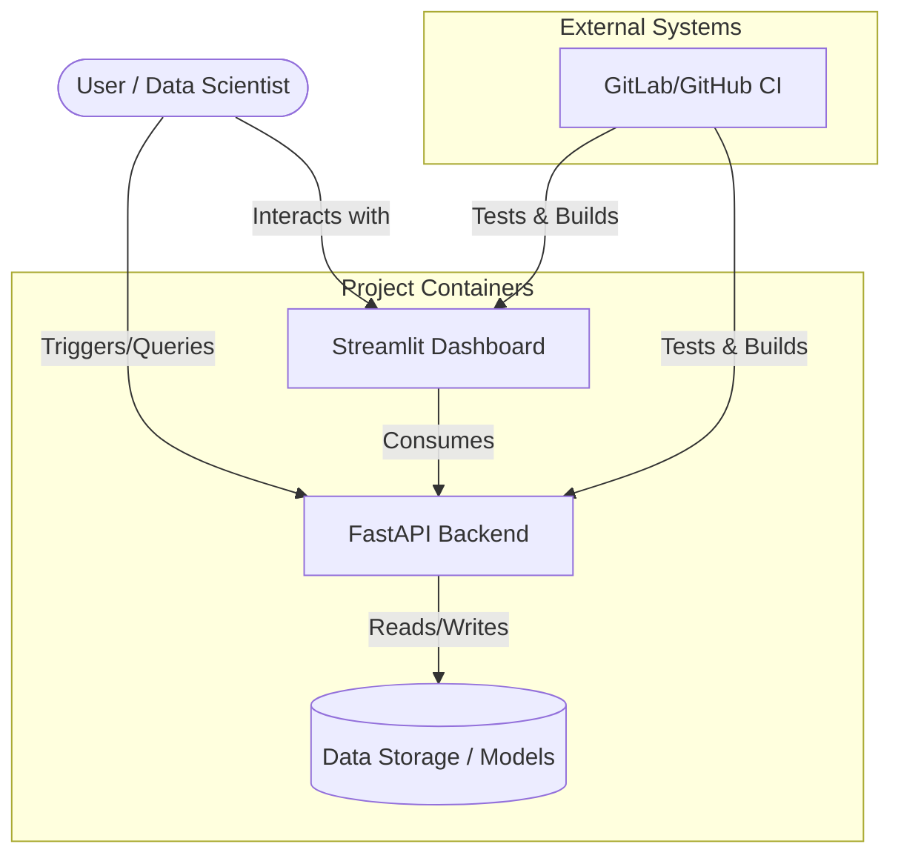

# 🏗️ Architecture: {{ cookiecutter.project_name }}

This document provides a high-level overview of the architectural design, component interactions, and technical choices for **{{ cookiecutter.project_name }}**.

---

## 🗺️ System Overview

The project follows a modular architecture designed for scalability, maintainability, and clear separation of concerns. It bridge the gap between Data Science research and Production-ready services.

### Container Diagram (C4 Level 2)

---

## 📦 Component breakdown

### 1. `src/{{ cookiecutter.package_name }}/core` (Core Logic)
This is the heartbeat of the project, independent of the delivery mechanism (API or App).

| Module | Responsibility |
| :--- | :--- |
| `data/` | Extraction (ETL), loading from external sources, and initial cleaning. |
| `features/` | Feature engineering logic, transformations, and preprocessing pipelines. |
| `models/` | Model definition, training scripts, and inference wrappers. |
| `utils/` | Shared utilities, logging configuration, and constants. |
| `visualization/` | Reusable plotting functions and reporting helpers. |

### 2. `app/` (Frontend)
Built with **Streamlit**, this layer provides a human-consumable interface for:
- Exploaring datasets (`data/raw`, `data/processed`).
- Visualizing model performance.
- Performing interactive "what-if" analysis.

### 3. `src/{{ cookiecutter.package_name }}/api/` (Backend)
Built with **FastAPI**, this layer exposes the core logic as RESTful endpoints:
- **Scalable**: Ready for deployment in a microservices environment.
- **Documented**: Automated Swagger/OpenAPI docs at `/docs`.
- **Decoupled**: Allows other systems to consume the models without knowing the internal implementation.

---

## 🔄 Data Flow

1. **Ingestion**: Raw data is placed in `data/raw/` or fetched via `src.data`.
2. **Processing**: Data is transformed and moved to `data/processed/`.
3. **Training**: `src.models` uses processed data to produce serialized models in `models/`.
4. **Consumption**: 
   - **Offline**: Notebooks or scripts import from `src`.
   - **Online**: API (`src.api`) loads the model and serves predictions; Streamlit (`app/`) displays the results.

---

## 🛠️ Technical Stack & Rationale

- **[uv](https://github.com/astral-sh/uv)**: Chosen for its extreme speed and ability to manage Python versions and dependencies in a single, unified tool.
- **[Ruff](https://github.com/astral-sh/ruff)**: A single tool replacing Flake8, Isort, and Black, providing near-instant linting and formatting.
- **[Dockerfile (Multi-stage)](dockerfiles/Dockerfile)**: Optimized for small image sizes and security by separating the build environment from the runtime environment.
- **[Pytest](https://docs.pytest.org/)**: The industry standard for robust, readable, and scalable testing.

---

## 📈 Scalability Note
The separation of `src` (logic) from `api` and `app` (interfaces) ensures that if the project grows, you can easily:
- Deploy the API as a standalone Kubernetes service.
- Use the core logic in distributed processing frameworks (like Spark).
- Expand the frontend without touching the underlying data pipelines.
