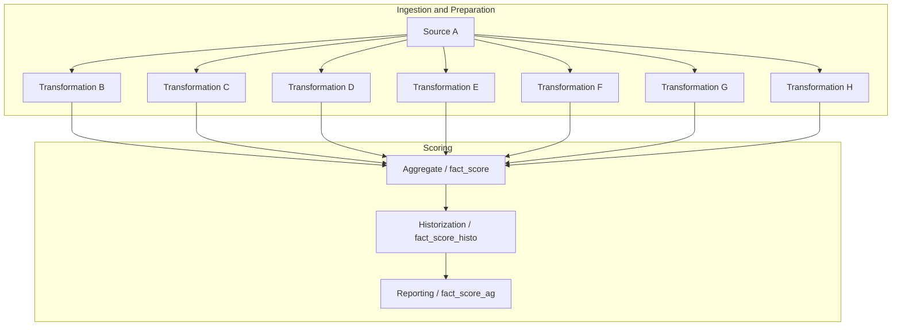

# 📌 Merge Request Subject

<!-- Summarize the purpose of this MR in one clear sentence -->

Title

## New Features

High-level developments

<!-- List the added features -->

*

## Fixes

List of fixes:

<!-- List the corrections / adjustments -->

*
*

# 🚶‍♂️ Walkthrough

<!-- Explain the main steps / technical impacts -->

This MR introduces ...

Additions:

<!-- List the additions -->

*

Modifications:

<!-- List the modifications -->

*

# 🗂️ Changes

| File Path          | Change Summary                |
| ------------------ | ----------------------------- |
| `path/to/file.sql` | Concise summary of the change |
| `path/to/file.sql` | Concise summary of the change |
| `path/to/file.sql` | Concise summary of the change |
| `path/to/file.sql` | Concise summary of the change |
| `path/to/file.sql` | Concise summary of the change |

# 📈 Sequence Diagram(s)

